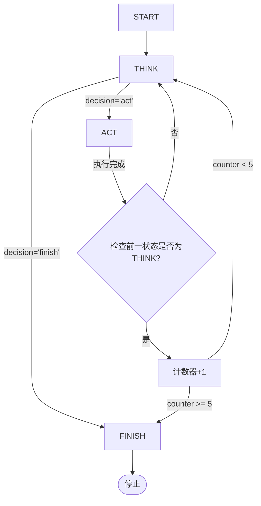

# 模块1：状态机与决策引擎（拒绝死循环）—— 技术规格说明书

## 1. 模块概述
**目标**：实现一个带超时和强制中断能力的 Workflow 状态机，核心职责是**防止任务陷入无限循环**，在循环次数超限后主动终止任务，并给出明确反馈。

**适用场景**：Agent/LLM 多轮推理与行动循环（ReAct 风格），当模型反复在“思考”和“行动”之间跳转而无法收敛时，引擎自动介入。

---

## 2. 状态定义（Enum）
| 状态 | 含义 |
|------|------|
| `START` | 工作流入口，初始化上下文，准备首轮输入 |
| `THINK` | 模型进行推理 / 规划 / 决策（不执行外部动作） |
| `ACT`   | 模型执行外部动作（调用工具、查询、计算等） |
| `FINISH`| 工作流正常或强制终止，输出最终结果 |

> 注：状态机为**确定性有限状态机（DFA）**，同一时刻仅处于一个状态。

---

## 3. 状态转换规则（基础）
- `START` → `THINK`（首次启动）
- `THINK` → `ACT`（思考后有行动意图）
- `THINK` → `FINISH`（思考后认为任务已完成或无需行动）
- `ACT` → `THINK`（行动后需要再次思考下一步）
- `ACT` → `FINISH`（行动后认为任务完成）

**强制转换**（由决策引擎触发）：
- 任意状态 → `FINISH`（当超时或循环次数超限时）

---

## 4. 核心机制：循环计数器（防死循环）

### 4.1 计数目标
监控 **“THINK ↔ ACT” 交替循环** 的次数。具体计数规则：
- 每完成一次 `THINK → ACT → THINK` 的完整闭环，计数器 **+1**。
- 初始计数器为 0。
- 当计数器 **≥ 5** 时，状态机强制转入 `FINISH`，并输出终止信息。

### 4.2 状态转换与计数器的交互（伪代码逻辑）
```
counter = 0
state = START
prev_state = None

while state != FINISH:
    if state == START:
        state = THINK
        prev_state = START

    elif state == THINK:
        # 执行思考逻辑（调用模型）
        decision = think()
        if decision == "act":
            state = ACT
        else:
            state = FINISH
        # 检查是否完成了一次闭环：prev_state==ACT 且 当前转出为ACT（即进入ACT前）
        # 实际计数时机放在从ACT转到THINK时更清晰，见下

    elif state == ACT:
        # 执行动作
        action_result = act()
        # 行动后通常需要再思考
        state = THINK
        # 检查：如果前一个状态是 THINK，且现在回到了 THINK，说明完成一轮
        if prev_state == THINK:
            counter += 1
            if counter >= 5:
                state = FINISH
                output = "任务过于复杂，已终止"
                break

    prev_state = 上一个有效状态（记录进入当前状态前的状态）
```

**精确计数触发点**：在从 `ACT` 转换到 `THINK` 时，检查 **上一次状态是否为 `THINK`**。若是，则计数器自增。这准确捕获了 `THINK -> ACT -> THINK` 的闭环。

### 4.3 阈值与终止信息
- 阈值：**5 次**（可配置，但 MVP 固定为 5）。
- 触发终止时，状态机**立即**跳至 `FINISH`，不再执行后续任何 `THINK` 或 `ACT` 逻辑。
- 最终输出信息固定为：**“任务过于复杂，已终止”**（可扩展为携带计数信息）。

---

## 5. 超时机制（扩展预留，MVP 可选）
- 为每个状态设置最大执行时间（例如 THINK ≤ 10s，ACT ≤ 5s）。
- 超时触发方式：异步监控或轮询检查，超时后同样强制转入 `FINISH`。
- MVP 阶段可不实现，但接口需预留 `timeout_ms` 参数。

---

## 6. 接口设计（Python 风格）

```python
from enum import Enum
from typing import Any, Callable, Optional

class WorkflowState(Enum):
    START = "start"
    THINK = "think"
    ACT = "act"
    FINISH = "finish"

class DecisionEngine:
    def __init__(self, max_loops: int = 5):
        self.max_loops = max_loops
        self.counter = 0
        self.state = WorkflowState.START
        self.prev_state = None
        self.terminated = False
        self.final_message = None

    def reset(self):
        """重置引擎，用于新任务"""
        self.counter = 0
        self.state = WorkflowState.START
        self.prev_state = None
        self.terminated = False
        self.final_message = None

    def step(self, think_fn: Callable[[], str], act_fn: Callable[[], Any]) -> dict:
        """
        执行一步状态转换，并返回当前状态及输出。
        
        :param think_fn: 无参数，返回 'act' 或 'finish' 的决策字符串。
        :param act_fn: 无参数，执行动作并返回结果（可选）。
        :return: {'state': WorkflowState, 'output': Any, 'terminated': bool}
        """
        if self.terminated or self.state == WorkflowState.FINISH:
            return {"state": WorkflowState.FINISH, "output": self.final_message, "terminated": True}

        # 处理 START
        if self.state == WorkflowState.START:
            self.state = WorkflowState.THINK
            self.prev_state = WorkflowState.START
            return {"state": self.state, "output": None, "terminated": False}

        # 处理 THINK
        if self.state == WorkflowState.THINK:
            decision = think_fn()
            if decision == "act":
                self.state = WorkflowState.ACT
            else:  # finish
                self.state = WorkflowState.FINISH
                return {"state": self.state, "output": "任务完成", "terminated": True}
            # 记录前一个状态为 THINK，准备进入 ACT
            self.prev_state = WorkflowState.THINK
            return {"state": self.state, "output": None, "terminated": False}

        # 处理 ACT
        if self.state == WorkflowState.ACT:
            result = act_fn()
            # 行动后转入 THINK
            self.state = WorkflowState.THINK
            # 检查是否构成闭环：如果前一个状态是 THINK，则计数
            if self.prev_state == WorkflowState.THINK:
                self.counter += 1
                if self.counter >= self.max_loops:
                    self.terminated = True
                    self.state = WorkflowState.FINISH
                    self.final_message = "任务过于复杂，已终止"
                    return {"state": self.state, "output": self.final_message, "terminated": True}
            self.prev_state = WorkflowState.ACT  # 更新前状态为 ACT
            return {"state": self.state, "output": result, "terminated": False}

        # fallback
        return {"state": WorkflowState.FINISH, "output": "未知错误", "terminated": True}
```

---

## 7. MVP 测试用例

### 7.1 输入
用户输入：  
`"请计算1+1，然后告诉我天气，再重复一遍1+1"`

### 7.2 预期行为（无强制中断时）
- 模型可能连续多轮 `THINK`（规划）→ `ACT`（计算/查天气）→ `THINK`（再确认）→ `ACT`（重复计算）…  
- 由于任务包含多个子任务且逻辑不够清晰，模型容易反复确认，导致循环。

### 7.3 强制中断验证
- 状态机启动，计数器初始为 0。
- 第一轮：`THINK(规划)` → `ACT(计算1+1)` → `THINK(确认结果)` → **计数器=1**
- 第二轮：`THINK(规划查天气)` → `ACT(查询天气)` → `THINK(确认天气)` → **计数器=2**
- 第三轮：`THINK(规划重复1+1)` → `ACT(重复计算)` → `THINK(确认结果)` → **计数器=3**
- 第四轮：模型可能仍觉得需要澄清，继续 `THINK` → `ACT` → `THINK` → **计数器=4**
- 第五轮：再次 `THINK` → `ACT` → `THINK` → **计数器=5** → **触发强制终止**，状态机立即转入 `FINISH`，输出 `"任务过于复杂，已终止"`。

> 注意：由于 MVP 固定阈值 5，实际第 3 个完整闭环后计数器为 3，**在第 5 次闭环时终止**，即约第 5 轮循环。若需“第3轮后终止”，可将 `max_loops` 设为 3，但需求原文写“超过5次时强制转入FINISH”，故按 5 次实现。若要求“必须在第3轮循环后输出”，则调整阈值为 3。此处**按需求原文“超过5次”**，即阈值为5。

---

## 8. 非功能性需求
- **确定性**：相同输入下，状态转换路径完全由 `think_fn` 和 `act_fn` 决定，引擎本身无随机性。
- **可观测性**：每次 `step()` 返回当前状态、输出及终止标志，便于上层日志记录。
- **轻量**：不依赖外部库，仅使用 Python 标准库。
- **可扩展**：预留超时参数 `timeout_per_state`，未来可集成异步超时检查。

---

## 9. 拒绝死循环的保障机制（总结）
| 机制 | 说明 |
|------|------|
| 状态闭环计数 | 精确统计 `THINK -> ACT -> THINK` 完整循环次数 |
| 硬阈值 | 达到 5 次后立即终止，无额外延迟 |
| 强制跳转 | 终止时直接置状态为 `FINISH`，忽略当前正在执行的 `think/act` |
| 明确终止信息 | 对外输出固定文案，让调用方知晓终止原因 |

---

## 10. 附录：状态转换图（Mermaid）



---

**文档版本**：v1.0  
**最后更新**：2026-08-02  
**责任人**：架构组